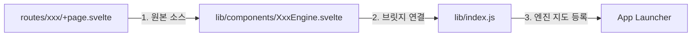

# 🚀 STATIC 앱 작성 및 승격 가이드 (The Bridge Strategy)

> 이 문서는 기존의 독립 페이지(`routes/`)를 시스템의 공식 앱(`App Registry`)으로 최소한의 비용으로 승격시키기 위한 **"하이브리드 브릿지"** 표준 개발 방법론을 정의합니다.

---

## 1. 🌟 핵심 철학 (Philosophy)

시스템 앱 개발 시 개발자가 구조적 제약에 얽매이지 않도록 합니다. 
- **독립성**: `/routes/my-app` 주소로 단독 실행 가능해야 함.
- **통합성**: `/app/my-app` 주소를 통해 범용 실행기(`App Launcher`) 내부에서도 실행 가능해야 함.
- **무복사(Zero-Copy)**: 코드를 복사하거나 옮기지 않고 **"링크(Link)"**만으로 앱을 등록함.

---

## 2. 🏗️ 아키텍처 구조 (Architecture)



---

## 3. 🛠️ 5단계 승격 절차 (Step-by-Step)

### 1단계: API 모듈 독립 (API-First)
`+page.server.js`의 `Form Actions`는 앱 실행기 내에서 작동하지 않습니다. 모든 통신 로직을 전역 API 모듈로 분리합니다.

```javascript
// svelte/src/lib/xxx.api.js
import { fastApi } from './api';

// 서버에 의존하지 않고 어디서든 호출 가능한 API 정의
export const getMyData = () => fastApi('GET', '/v1/xxx/list');
export const saveData = (data) => fastApi('POST', '/v1/xxx/create', data);
```

### 2단계: 자립형 컴포넌트 작성 (Self-Loading)
원본 페이지(`+page.svelte`)가 서버 데이터(`data`)가 없을 때 스스로 데이터를 가져오도록 "지능"을 부여합니다.

```svelte
<script>
  import { onMount } from "svelte";
  import * as api from "$lib/xxx.api";

  let { data } = $props(); // 서버에서 주는 데이터
  
  // 데이터가 없으면(앱 모드) 직접 로딩, 있으면(페이지 모드) 그대로 사용
  let list = $state(data?.list || []);

  onMount(async () => {
    if (list.length === 0) {
      const res = await api.getMyData();
      list = res.data;
    }
  });
</script>
```

### 3단계: 브릿지 컴포넌트 생성 (The Bridge)
`lib/components/` 하위에 원본 페이지를 호출하는 껍데기(Bridge)를 만듭니다. 이 파일이 실제 시스템 엔진이 됩니다.

```svelte
<!-- svelte/src/lib/components/XxxEngine.svelte -->
<script>
  // [v1.0] 브릿지 전략: 원본 페이지를 시스템 앱으로 연결
  import OriginalPage from '../../routes/xxx/+page.svelte';
  let { ...props } = $props();
</script>

<OriginalPage {...props} />
```

### 4단계: 엔진 지도 등록 (Registry Mapping)
`lib/index.js`에 브릿지 컴포넌트를 등록하여 시스템이 이름을 인식하게 합니다.

```javascript
// svelte/src/lib/index.js
export { default as XxxEngine } from './components/XxxEngine.svelte';
```

### 5단계: 시스템 앱 등록 (Final Registration)
관리자 UI(`/v1/admin/app`)에서 다음 정보를 입력합니다.
- **App ID**: `myapp`
- **App Type**: `STATIC`
- **Main Component**: `XxxEngine`
- **Frontend Route**: `/app/myapp`

---

## 4. ⚠️ 주의 사항 및 해결 (Pitfalls)

### 4.1 불변성 유지 (State Mutation)
Svelte 5 룬 배열을 정렬하거나 수정할 때 원본을 직접 건드리면 `state_unsafe_mutation` 에러가 발생합니다. 항상 복사본을 만드세요.
- **Bad**: `{#each list.sort() as item}`
- **Good**: `{#each [...list].sort() as item}`

### 4.2 Form Action 사용 금지
앱 실행기 내에서는 `<form method="POST">`가 현재 URL인 `/app/...`으로 전송되어 405 에러가 납니다. 반드시 `onsubmit` 이벤트와 `Fetch` (API 모듈) 방식을 사용하세요.

---

## 5. 💡 기대 효과 (Benefits)
- **개발 생산성**: 페이지 만들던 실력 그대로 시스템 전체 앱을 개발할 수 있음.
- **안정성**: 독립 페이지 테스트와 통합 앱 테스트가 동시에 이루어짐.
- **확장성**: 새로운 기능 추가 시 소스 코드 배포 없이 UI에서 엔진 이름만 적어주면 즉시 서비스 가능.

---
**좌우명**: "가장 단순한 연결이 가장 강력한 아키텍처를 만든다."
