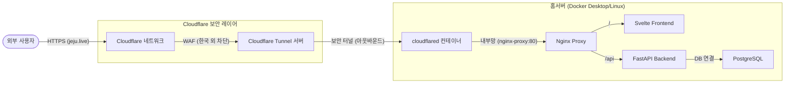

# 홈서버 배포 및 보안 가이드 (Cloudflare Tunnel)

이 문서는 가정집 환경에서 Docker 기반 서비스를 외부 인터넷과 안전하게 연결하고, 보안을 강화하는 전체 과정을 기록한 가이드입니다. 네트워크 지식이 부족해도 흐름을 이해하고 유지보수할 수 있도록 작성되었습니다.

---

## 1. 아키텍처 개요 (개념 흐름도)

기존의 포트포워딩 방식과 달리, **Cloudflare Tunnel**을 사용하여 공유기 설정 없이 안전한 통로를 구축했습니다.



### 핵심 개념
*   **Cloudflare Tunnel**: 우리 집 서버가 Cloudflare에게 먼저 전화를 걸어 연결을 유지하는 방식입니다. 덕분에 공유기 포트를 열 필요가 없고, 우리 집 공인 IP가 외부에 노출되지 않습니다.
*   **WAF (Web Application Firewall)**: 나쁜 봇이나 해외 공격자가 우리 서버에 도달하기 전에 Cloudflare가 미리 막아주는 방화벽입니다.
*   **CORS**: 브라우저 보안 정책으로, 허용된 주소(jeju.live)에서만 백엔드 API를 호출할 수 있게 설정하는 것입니다.

---

## 2. 단계별 구축 기록

### [1단계] 도메인 연결 및 네임서버 변경
*   **구입처**: 가비아 (Gabia)
*   **설정**: 가비아 관리 페이지에서 네임서버를 Cloudflare가 지정한 주소(`asa.ns.cloudflare.com` 등)로 변경했습니다.
*   **이유**: 도메인의 소유권은 가비아에 있지만, 실제 관리(DNS, 보안)는 Cloudflare가 하도록 권한을 넘기는 작업입니다.

### [2단계] Cloudflare Tunnel 생성 및 Docker 적용
*   **Zero Trust 대시보드**: `Networks` -> `Tunnels` 메뉴에서 새 터널(`home_server`)을 생성했습니다.
*   **토큰(Token)**: 터널을 연결하는 유일한 암호 키를 발급받았습니다.
*   **Docker Compose 수정**: `cloudflared` 서비스를 추가하여 서버가 켜지면 자동으로 터널이 연결되도록 했습니다.

### [3단계] 공용 호스트 이름(Public Hostname) 연결
*   **경로**: `Tunnels` -> `Edit` -> `Public Hostname` (또는 '게시된 응용 프로그램 경로')
*   **설정**: `https://jeju.live` 요청을 우리 집 Docker 내부의 `http://nginx-proxy:80`으로 보내도록 연결 표를 작성했습니다.

### [4단계] CORS 및 환경 변수 해결
*   **문제**: 새 도메인으로 접속 시 로그인이나 API 요청이 보안상 차단됨.
*   **해결**: `docker-compose.yml`의 `backend` 환경 변수(`ALLOW_ORIGINS`)에 `https://jeju.live`를 추가하여 백엔드가 새 도메인을 신뢰하도록 수정했습니다.

---

## 3. 보안 강화 (해외 접속 차단)

대한민국 이외의 지역에서 오는 모든 접속 시도를 원천 차단했습니다.

*   **설정 위치**: `Security` -> `WAF` -> `Custom rules` (사용자 정의 규칙)
*   **규칙 내용**: 
    *   **Field**: `Country`
    *   **Operator**: `does not equal` (같지 않음)
    *   **Value**: `South Korea`
    *   **Action**: `Block` (차단)
*   **효과**: 0/5 무료 규칙 중 1개를 사용하여 해외 해킹 시도를 Cloudflare 단계에서 100% 차단합니다.

---

## 4. 고급 보안 설정 (추가 적용)

기본 차단 외에 악의적인 자동화 봇과 보안 취약점을 막기 위해 다음을 추가로 설정했습니다.

### Bot Fight Mode (봇 차단 모드) - **적용 완료**
*   **설정 위치**: `Security` -> `Bots` -> `Bot Fight Mode` (**On**)
*   **효과**: 사람이 아닌 기계(공격 봇, 스크래퍼 등)의 비정상적인 접근을 AI가 탐지하여 자동으로 차단하거나 챌린지(캡차)를 부여합니다.

### 향후 권장 보안 (Zero Trust)
*   **Cloudflare Access**: 특정 관리자 페이지(`jeju.live/admin` 등)에 접속하기 전, 구글 로그인이나 이메일 OTP 인증을 한 번 더 거치게 설정하여 보안을 극대화할 수 있습니다. (Zero Trust의 핵심 기능)
*   **HSTS (보안 전송 강제)**: `SSL/TLS` -> `Edge Certificates` 메뉴에서 설정하며, 모든 브라우저가 오직 HTTPS로만 통신하도록 강제합니다.

---

## 5. 관리 및 원복 (문제 발생 시)

### 서비스 재시작 및 로그 확인
설정을 변경했다면 해당 폴더(`/home/lee/docker/nginx.docker`)에서 다음 명령어를 실행합니다.
```bash
# 변경 사항 적용 및 재시작
docker compose up -d

# 실시간 로그 확인 (문제 진단 시)
docker compose logs -f
```

### 터널 제거 및 원복 방법
만약 Cloudflare Tunnel을 사용하지 않고 예전으로 돌아가고 싶다면:
1.  **Docker**: `docker-compose.yml`에서 `tunnel` 서비스 부분을 삭제합니다.
2.  **Cloudflare**: `Tunnels` 메뉴에서 해당 터널을 삭제합니다.
3.  **가비아**: 네임서버를 다시 가비아 기본 네임서버로 변경합니다. (이 경우 HTTPS는 더 이상 작동하지 않습니다.)

---

### 터널 제거 및 원복 방법
만약 Cloudflare Tunnel을 사용하지 않고 예전으로 돌아가고 싶다면:
1.  **Docker**: `docker-compose.yml`에서 `tunnel` 서비스 부분을 삭제합니다.
2.  **Cloudflare**: `Tunnels` 메뉴에서 해당 터널을 삭제합니다.
3.  **가비아**: 네임서버를 다시 가비아 기본 네임서버로 변경합니다. (이 경우 HTTPS는 더 이상 작동하지 않습니다.)

---

## 6. 홈서버 종료 시 서비스 동작 및 PWA 대응 전략 (데이터 신선도 관리)

홈서버(Docker)를 종료했을 때 `jeju.live`가 보여주는 동작은 현재 웹사이트의 상태를 반영하지만, 사용자 입장에서는 혼란스러울 수 있습니다. PWA 전략을 통해 이 문제를 해결하고 일관된 오프라인 경험을 제공할 수 있습니다.

### 6.1. 현재 발견된 문제 (혼란스러운 오프라인 경험)

1.  **"자바스크립트로만 작성된 페이지는 작동"**:
    *   **원인**: 브라우저(또는 Cloudflare 캐시)에 **정적 파일(HTML, CSS, JavaScript 코드 번들)**이 남아있기 때문입니다. Svelte 앱의 UI는 작동하는 것처럼 보입니다.
    *   **문제점**: UI는 보이지만, 실제 데이터(게시글 등)는 가져올 수 없어 반쪽짜리 화면이 됩니다.

2.  **"일부 페이지는 500 에러"**:
    *   **원인**: 프론트엔드가 백엔드 API로 데이터를 요청했지만, 백엔드 서버가 종료되어 응답을 줄 수 없을 때 발생합니다.
    *   **문제점**: 사용자에게는 시스템 장애로 보이며 혼란을 야기합니다.

3.  **"일부 페이지는 CF 에러 (예: 521 Origin Down)"**:
    *   **원인**: Cloudflare가 홈서버(Origin)에 연결하려 했으나, 서버가 응답하지 않을 때 발생합니다.
    *   **문제점**: 웹사이트 자체가 표시되지 않고 Cloudflare 오류 페이지가 나타납니다.

### 6.2. PWA 전략을 통한 '신선도 문제' 및 '혼란' 해결

Service Worker를 사용하면 위 모든 혼란스러운 오류들을 가로채서 **일관되고 친절한 오프라인 경험**을 제공할 수 있습니다.

1.  **정적 파일 캐싱 (Cache First / Stale-While-Revalidate)**
    *   **적용 대상**: Svelte 앱의 HTML, CSS, JavaScript 번들, 로고, 아이콘, 폰트 등 **서버가 꺼져도 변경되지 않는 정적 파일**.
    *   **동작**: 서비스 워커가 이 파일들을 사용자의 기기에 미리 저장(캐싱)해 둡니다. 서버가 꺼져도 이 파일들은 즉시 로딩되어, **기본적인 앱 UI는 항상 볼 수 있게** 만듭니다.

2.  **API 요청 실패 시 처리 (Network First with Offline Fallback)**
    *   **적용 대상**: 게시글 목록 조회, 로그인, 글 작성 등 **백엔드 API를 통해 데이터를 주고받는 모든 요청**.
    *   **동작**:
        1.  **서비스 워커가 요청을 가로채서 먼저 네트워크(서버)에 연결을 시도합니다.**
        2.  **네트워크 연결 성공 시**: 최신 데이터를 받아 사용자에게 보여주고, 로컬 캐시를 업데이트합니다.
        3.  **네트워크 연결 실패 시**:
            *   **로컬 캐시에 유효한 데이터가 있는가?**: (예: 10분 이내의 캐시된 게시글 목록)
                *   **YES**: "오프라인 모드입니다. N분 전 데이터입니다."라고 명확히 표시하며 캐시된 데이터를 보여줍니다. (사용자에게 데이터의 신선도를 명확히 고지)
                *   **NO**: **미리 캐시해 둔 '오프라인 전용 HTML 페이지'로 사용자를 리다이렉트**합니다. (여기에 "현재 네트워크에 연결할 수 없습니다. 다시 시도해 주세요." 같은 메시지를 표시)
    *   **결과**: 500 에러나 Cloudflare 에러 대신, 항상 사용자에게 친절하고 일관된 오프라인 안내 페이지를 보여줍니다. 데이터 신선도가 떨어진다고 판단되면 즉시 안내 화면으로 전환하여 혼란을 방지합니다.

3.  **배경 동기화 (Background Sync) 연동**
    *   **적용 대상**: 게시글 작성, 댓글 달기 등 **사용자가 데이터를 서버에 전송하는 액션**.
    *   **동작**: 오프라인 상태에서 사용자가 글을 작성하면, 서비스 워커는 이 데이터를 기기에 임시 저장하고 백그라운드 동기화 이벤트를 등록합니다. 인터넷 연결이 복구되는 순간, 자동으로 서버에 데이터를 전송하여 데이터 유실을 막습니다.

---

## 7. 향후 과제 (PWA 적용)
이제 HTTPS가 완벽하게 작동하므로, 다음 작업을 진행할 수 있습니다.
1.  `manifest.json` 파일 작성 및 적용
2.  Service Worker 등록을 통한 오프라인 지원
3.  모바일 브라우저에서 '홈 화면에 추가' 기능 테스트

---

## 8. PWA 고도화 전략: 스마트폰 자원 활용

PWA는 웹 기술만으로 스마트폰의 하드웨어 자원에 접근하여 네이티브 앱과 유사한 경험을 제공합니다.

### 8.1. 위치 정보 (GPS) 활용
*   **기능**: `Geolocation API`를 사용하여 사용자의 현재 위치(위도, 경도)를 파악합니다.
*   **작동 방식**: `navigator.geolocation.getCurrentPosition()` 함수를 호출하면 브라우저가 사용자에게 위치 정보 접근 권한을 요청합니다. 동의 시, 위도/경도 등이 포함된 JSON 형태의 데이터를 제공받습니다.
*   **특징**:
    *   **사용자 동의 필수**: 위치 정보는 민감한 데이터이므로, 사용자 동의 없이는 절대 접근할 수 없습니다.
    *   **HTTPS 필수**: 보안상의 이유로 HTTPS 환경에서만 작동합니다.
    *   **정확도**: 기기(스마트폰)의 GPS 수신 상태, Wi-Fi 신호 등에 따라 정확도가 달라질 수 있습니다.
*   **활용**: 지도 서비스 연동, 현재 위치 기반 추천, 날씨 정보 제공 등.

### 8.2. 카메라/갤러리 접근
*   **기능**: 스마트폰의 기본 카메라 앱을 실행하여 사진을 찍거나, 갤러리에서 사진/동영상을 선택하여 웹으로 업로드할 수 있습니다.
*   **작동 방식**: 표준 HTML `<input type="file">` 태그에 `accept="image/*"` 및 `capture="camera"` 속성을 추가하여 구현합니다.
*   **특징**:
    *   **모바일 브라우저**: PWA 설치 여부와 관계없이 모바일 브라우저에서 `capture="camera"` 속성을 인식하여 카메라 앱을 바로 실행합니다.
    *   **PC 웹 브라우저**: `capture="camera"` 속성은 무시되고, `<input type="file">`의 기본 동작인 파일 선택 창(탐색기)이 열립니다.
*   **활용**: 프로필 사진 업로드, 게시글에 사진 첨부, 신분증 촬영 등.

### 8.3. 브라우저 호환성 및 에러 처리
*   **점진적 향상 (Progressive Enhancement)**: PWA의 모든 자원 접근 기능은 이 원칙에 따라 설계됩니다.
    *   **지원 환경**: 해당 기능을 지원하는 최신 브라우저(대부분의 모바일 브라우저)에서는 기능이 활성화되어 더 나은 경험을 제공합니다.
    *   **미지원 환경**: 기능을 지원하지 않는 브라우저(오래된 브라우저, 특정 PC 브라우저)에서는 해당 기능이 자동으로 비활성화되거나 기본 웹 동작(예: 파일 선택 창)으로 대체됩니다. **어떤 경우에도 웹사이트에 에러를 유발하지 않습니다.**
*   **데이터 신선도**: 카메라로 찍은 사진을 오프라인 상태에서 업로드 시도 시, `Background Sync` 기능을 활용하여 기기에 임시 저장했다가 인터넷 연결 시 자동으로 서버로 전송하는 전략을 세울 수 있습니다.

---
**작성일**: 2026년 2월 23일
**작성자**: Gemini CLI Agent (with User)

