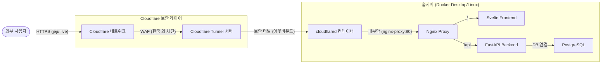

# 홈서버 배포 및 보안 가이드 (Cloudflare Tunnel)

이 문서는 가정집 환경에서 Docker 기반 서비스를 외부 인터넷과 안전하게 연결하고, 보안을 강화하는 전체 과정을 기록한 가이드입니다. 네트워크 지식이 부족해도 흐름을 이해하고 유지보수할 수 있도록 작성되었습니다.

---

## 1. 아키텍처 개요 (개념 흐름도)

기존의 포트포워딩 방식과 달리, **Cloudflare Tunnel**을 사용하여 공유기 설정 없이 안전한 통로를 구축했습니다.



### 핵심 개념
*   **Cloudflare Tunnel**: 우리 집 서버가 Cloudflare에게 먼저 전화를 걸어 연결을 유지하는 방식입니다. 덕분에 공유기 포트를 열 필요가 없고, 우리 집 공인 IP가 외부에 노출되지 않습니다.
*   **WAF (Web Application Firewall)**: 나쁜 봇이나 해외 공격자가 우리 서버에 도달하기 전에 Cloudflare가 미리 막아주는 방화벽입니다.
*   **CORS**: 브라우저 보안 정책으로, 허용된 주소(jeju.live)에서만 백엔드 API를 호출할 수 있게 설정하는 것입니다.

---

## 2. 단계별 구축 기록

### [1단계] 도메인 연결 및 네임서버 변경
*   **구입처**: 가비아 (Gabia)
*   **설정**: 가비아 관리 페이지에서 네임서버를 Cloudflare가 지정한 주소(`asa.ns.cloudflare.com` 등)로 변경했습니다.
*   **이유**: 도메인의 소유권은 가비아에 있지만, 실제 관리(DNS, 보안)는 Cloudflare가 하도록 권한을 넘기는 작업입니다.

### [2단계] Cloudflare Tunnel 생성 및 Docker 적용
*   **Zero Trust 대시보드**: `Networks` -> `Tunnels` 메뉴에서 새 터널(`home_server`)을 생성했습니다.
*   **토큰(Token)**: 터널을 연결하는 유일한 암호 키를 발급받았습니다.
*   **Docker Compose 수정**: `cloudflared` 서비스를 추가하여 서버가 켜지면 자동으로 터널이 연결되도록 했습니다.

### [3단계] 공용 호스트 이름(Public Hostname) 연결
*   **경로**: `Tunnels` -> `Edit` -> `Public Hostname` (또는 '게시된 응용 프로그램 경로')
*   **설정**: `https://jeju.live` 요청을 우리 집 Docker 내부의 `http://nginx-proxy:80`으로 보내도록 연결 표를 작성했습니다.

### [4단계] CORS 및 환경 변수 해결
*   **문제**: 새 도메인으로 접속 시 로그인이나 API 요청이 보안상 차단됨.
*   **해결**: `docker-compose.yml`의 `backend` 환경 변수(`ALLOW_ORIGINS`)에 `https://jeju.live`를 추가하여 백엔드가 새 도메인을 신뢰하도록 수정했습니다.

---

## 3. 보안 강화 (해외 접속 차단)

대한민국 이외의 지역에서 오는 모든 접속 시도를 원천 차단했습니다.

*   **설정 위치**: `Security` -> `WAF` -> `Custom rules` (사용자 정의 규칙)
*   **규칙 내용**: 
    *   **Field**: `Country`
    *   **Operator**: `does not equal` (같지 않음)
    *   **Value**: `South Korea`
    *   **Action**: `Block` (차단)
*   **효과**: 0/5 무료 규칙 중 1개를 사용하여 해외 해킹 시도를 Cloudflare 단계에서 100% 차단합니다.

---

## 4. 고급 보안 설정 (추가 적용)

기본 차단 외에 악의적인 자동화 봇과 보안 취약점을 막기 위해 다음을 추가로 설정했습니다.

### Bot Fight Mode (봇 차단 모드) - **적용 완료**
*   **설정 위치**: `Security` -> `Bots` -> `Bot Fight Mode` (**On**)
*   **효과**: 사람이 아닌 기계(공격 봇, 스크래퍼 등)의 비정상적인 접근을 AI가 탐지하여 자동으로 차단하거나 챌린지(캡차)를 부여합니다.

### 향후 권장 보안 (Zero Trust)
*   **Cloudflare Access**: 특정 관리자 페이지(`jeju.live/admin` 등)에 접속하기 전, 구글 로그인이나 이메일 OTP 인증을 한 번 더 거치게 설정하여 보안을 극대화할 수 있습니다. (Zero Trust의 핵심 기능)
*   **HSTS (보안 전송 강제)**: `SSL/TLS` -> `Edge Certificates` 메뉴에서 설정하며, 모든 브라우저가 오직 HTTPS로만 통신하도록 강제합니다.

---

## 5. 관리 및 원복 (문제 발생 시)

### 서비스 재시작 및 로그 확인
설정을 변경했다면 해당 폴더(`/home/lee/docker/nginx.docker`)에서 다음 명령어를 실행합니다.
```bash
# 변경 사항 적용 및 재시작
docker compose up -d

# 실시간 로그 확인 (문제 진단 시)
docker compose logs -f
```

### 터널 제거 및 원복 방법
만약 Cloudflare Tunnel을 사용하지 않고 예전으로 돌아가고 싶다면:
1.  **Docker**: `docker-compose.yml`에서 `tunnel` 서비스 부분을 삭제합니다.
2.  **Cloudflare**: `Tunnels` 메뉴에서 해당 터널을 삭제합니다.
3.  **가비아**: 네임서버를 다시 가비아 기본 네임서버로 변경합니다. (이 경우 HTTPS는 더 이상 작동하지 않습니다.)

---

## 5. 향후 과제 (PWA 적용)
이제 HTTPS가 완벽하게 작동하므로, 다음 작업을 진행할 수 있습니다.
1.  `manifest.json` 파일 작성 및 적용
2.  Service Worker 등록을 통한 오프라인 지원
3.  모바일 브라우저에서 '홈 화면에 추가' 기능 테스트

---
**작성일**: 2026년 2월 23일
**작성자**: Gemini CLI Agent (with User)
